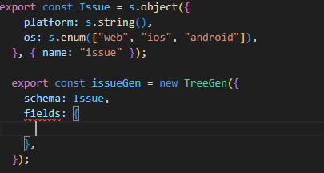
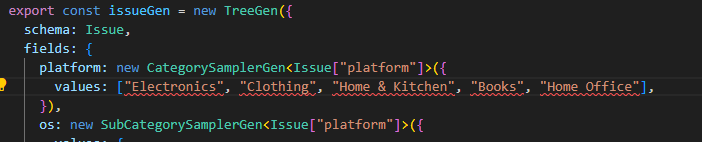
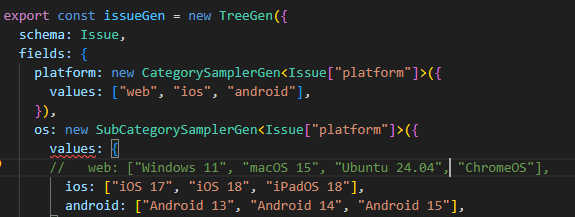

# TS-SynthDesigner

**Synthetic data generation for TypeScript: schema-first trees, DAG dependency tracking, typed LLM calls.**

A typed, schema-based synthetic data generator where every row is a fully qualified object, with optional sub-objects of its own. Compile time type checks make it easier to quickly catch typos, silly mistakes and get better IDE autocomplete suggestions. This is backed up by full runtime validation.

Each field can generate data based on other fields already assigned. The fields are generated in correct order at runtime, including waiting for LLM calls.

Inspired by [NVIDIA NeMo Data Designer](https://github.com/NVIDIA-NeMo/DataDesigner), and ports two of its
tutorials (see [Examples](#examples)). This is an independent project, not affiliated with NVIDIA.

## Highlights

- **Compile-time checks.** Type checking ensures you have hooked up the correct generators, dependencies are guaranteed correct even when tracking an object tree, eg: `person.friend.address`, callbacks know their argument types, LLMs return known types.
- **Typed, validated LLM replies.** One schema gives the TypeScript type, the shape the model is
  told to reply in, and the check of each reply. An invalid reply is retried, with the model shown
  exactly what was wrong.
- **Dependencies as a DAG.** Fields can read siblings, their parent or the root of the record. The
  generation order comes from those reads, and cycles are reported up front.
- **Constrained and custom fields.** Rejection sampling with conditions on other fields, plus plain
  functions as generators, typed from their inputs.
- **Prompt building.** Tagged-template prompts whose holes are typed refs, conditional sections
  (`match`), JSON for nested values, and only the rows that need an LLM call make one.
- **Reproducible.** One seed gives the same data, at any batch size.

## Quick look

A person with three fields: `city` depends on `country`.

```ts
import { CategorySamplerGen, NumberSamplerGen, preview, rootRefs, s, SubCategorySamplerGen, TreeGen } from "ts-synthdesigner";

const Person = s.object({
  country: s.string(),
  city: s.string(),
  age: s.integer({ min: 0, max: 120 }),
});
const p = rootRefs(Person); // typed refs to Person's fields

const person = new TreeGen({
  schema: Person,
  fields: {
    country: new CategorySamplerGen({ values: { Canada: 2, Japan: 1 } }), // weighted
    city: new SubCategorySamplerGen({
      values: { Canada: ["Toronto", "Vancouver"], Japan: ["Tokyo", "Kyoto"] },
    }).bind({ category: p.country }), // city depends on country
    age: new NumberSamplerGen({ type: "uniform", low: 18, high: 90, integer: true }),
  },
});

const { records } = await preview({ gen: person, numRecords: 5, seed: 2026 });
// [{ country: "Japan", city: "Tokyo", age: 48 }, { country: "Japan", city: "Kyoto", age: 80 },
//  { country: "Canada", city: "Vancouver", age: 57 }, ...]
```

The same tree, built step by step, for loops, conditionals or fields added later. Each `field()` is
type-checked, and `build()` checks that every field has a generator:

```ts
const b = TreeGen.builder({ schema: Person });
b.field({ name: "country", gen: new CategorySamplerGen({ values: { Canada: 2, Japan: 1 } }) });
b.field({
  name: "city",
  gen: new SubCategorySamplerGen({
    values: { Canada: ["Toronto", "Vancouver"], Japan: ["Tokyo", "Kyoto"] },
  }).bind({ category: p.country }),
});
b.field({ name: "age", gen: new NumberSamplerGen({ type: "uniform", low: 18, high: 90, integer: true }) });
const samePerson = b.build();
```

Trees nest: a field can be another `TreeGen`, whose fields can read the parent (`parentRefs`) or the
top of the record (`rootRefs`).

## Compile-time checks

Each of these is a compile error:

```ts
p.cuntry;                     // no field 'cuntry' on Person

new TreeGen({
  schema: Person,
  fields: { country, city },  // 'age' has no generator
});

new TreeGen({
  schema: Person,
  fields: {
    country,
    city: new SubCategorySamplerGen({ values: { Canada: ["Toronto"] } }), // input 'category' not bound
    age: new CategorySamplerGen({ values: ["young", "old"] }),            // age is a number, this makes strings
  },
});

cityGen.bind({ category: p.age });                         // category is a string, age is a number
new NumberSamplerGen({ type: "gaussian", mean: 170, high: 200 }); // gaussian takes stddev, not high

CustomGen.bound({ inputs: { age: p.age }, fn: ({ age }) => age.toUpperCase() }); // age is a number
```

In the editor, as you type:

| | |
|---|---|
|  | `fields: {}` is empty: every field of the schema needs a generator. |
|  | `platform` is typed as `"web" \| "ios" \| "android"`, so each value that is not a platform is flagged. |
|  | The OS map is keyed by platform, and `web` is commented out: the map must cover every platform. |

What types cannot see (bounds, enum values from an LLM, plain JavaScript) is checked at runtime:
every record is validated against its schema, and the error names the record and the field.

## LLM fields with typed replies

```ts
const Review = s.object({
  rating: s.integer({ min: 1, max: 5 }),
  mood: s.enum(["happy", "neutral", "mad"]),
  text: s.string({ description: "the review, nothing else" }),
});
const Order = s.object({
  product: s.string(),
  customer: s.string(),
  ageGroup: s.enum(["teen", "adult", "senior"]),
  review: Review,
});
const o = rootRefs(Order);

const order = new TreeGen({
  schema: Order,
  fields: {
    product: new CategorySamplerGen({ values: ["desk lamp", "kettle"] }),
    customer: new CategorySamplerGen({ values: ["Ada", "Linus"] }),
    ageGroup: new CategorySamplerGen<"teen" | "adult" | "senior">({ values: ["teen", "adult", "senior"] }),
    review: new LLMStructuredGen({
      model: "review-writer-model",
      schema: Review,
      // The refs in the prompt are the fields it reads: no separate list of inputs to keep in sync.
      prompt: prompt`Write a review of a ${o.product} bought by ${o.customer}.`
        .match({ // conditional text, picked by the row's values
          inputs: { age: o.ageGroup },
          cases: [
            { when: ({ age }) => age === "teen", then: " Write it like a text message." },
            { when: ({ age }) => age === "senior", then: prompt` Say whether ${o.customer} found it easy to set up.` },
          ],
          otherwise: " Keep it to two sentences.",
        }),
      maxAttempts: 3,
    }),
  },
});

const { records } = await preview({
  gen: order,
  numRecords: 10,
  seed: 1,
  providers: { openrouter: Provider.openRouter() }, // key from OPENROUTER_API_KEY
  models: { "review-writer-model": { provider: "openrouter", model: "qwen/qwen3.8-flash", temperature: 1 } },
});
records[0].review.mood; // typed: "happy" | "neutral" | "mad"
```

The prompts sent for four rows:

```text
Write a review of a desk lamp bought by Linus. Say whether Linus found it easy to set up.
Write a review of a desk lamp bought by Ada. Say whether Ada found it easy to set up.
Write a review of a kettle bought by Linus. Write it like a text message.
...
```

Prompts are checked too:
- `when` gets typed inputs: `age === "teenager"` is a compile error, since it can never match.
- `${o.review}` is a compile error: an object has no obvious text form. `json(o.review)` writes it
  as indented JSON.
- Jinja-style `{{ name }}` is reported as an error instead of reaching the model as literal text.

The model is told the shape and the rules, generated from the schema, so they cannot drift from
what is validated. When a reply breaks them, the retry shows the model its reply and the problems:

```text
Write a review of a desk lamp bought by Linus. Say whether Linus found it easy to set up.

Reply with only a JSON object of this shape (plain JSON, no comments, no other text):
{
  "rating": integer,
  "mood": "happy" | "neutral" | "mad",
  "text": string
}

Fields:
- rating: an integer from 1 to 5
- mood: one of "happy", "neutral", "mad"
- text: the review, nothing else

Your previous reply was:
{"rating": 7, "mood": "ecstatic", "text": "Bright, sturdy and easy to set up."}

It had these problems:
- rating: expected an integer from 1 to 5, got 7
- mood: expected one of "happy", "neutral", "mad", got "ecstatic"

Reply again with the corrected JSON only.
```

Also:
- Numbers with `decimalPlaces` are rounded rather than rejected.
- `apiGuidedDecoding: true` asks the API to enforce the JSON Schema; replies are still validated.
- `onFailure: "default"` uses a fallback value instead of failing the run.
- `reasoningOf(o.review)` puts a reasoning model's thinking in a field of its own.
- `MatchGen` makes a whole field conditional: rows that match no case get no value, and make no
  LLM call.

Providers: OpenAI-format endpoints (OpenAI, OpenRouter, NVIDIA, Ollama, vLLM) and Anthropic, with
retries and a concurrency limit. `MockProvider` answers without a network, for tests and demos.

## Constrained and custom fields

```ts
const e = rootRefs(Employee);

const employee = new TreeGen({
  schema: Employee,
  fields: {
    age: new NumberSamplerGen({ type: "uniform", low: 18, high: 70, integer: true }),
    role: new CategorySamplerGen({ values: ["intern", "engineer", "manager"] }),

    // Rejection sampling: redraw until the condition holds. The condition can read other fields.
    salary: ConditionalRejectionResamplerGen.bound({
      childGen: new NumberSamplerGen({ type: "gaussian", mean: 90_000, stddev: 30_000, decimalPlaces: 0 }),
      inputs: { role: e.role },
      accept: (salary, { role }) => salary > 20_000 && (role !== "intern" || salary < 50_000),
    }),

    // Any function. Its inputs are typed from the refs; randomness comes from the seeded ctx.rng.
    badge: CustomGen.bound({
      inputs: { role: e.role, age: e.age },
      fn: ({ role, age }, ctx) => `${role.toUpperCase()}-${age}-${ctx.rng.int(1000, 9999)}`,
    }),
  },
});
```

Also: `FunctionGen` for `field2 = f(field1)`, `ConstantGen` for a value shared by every row,
`FakerGen` for names, emails and addresses (faker-js, optional), and `.temp()` fields that other
fields can read but that are dropped from the output (the output type drops them too).

## Effortless deep references

Let us create an `Address` schema which can be subtree of a `Person` schema.

```ts
const Address = s.object({ country: s.string(), city: s.string() });
const a = refs(Address); // refs relative to the address

const addressGen = new TreeGen({
  schema: Address,
  fields: {
    country: new CategorySamplerGen({ values: ["Canada", "Japan"] }),
    city: new SubCategorySamplerGen({
      values: { Canada: ["Toronto", "Vancouver", "Montreal"], Japan: ["Tokyo", "Osaka", "Kyoto"] },
    }).bind({ category: a.country }),
  },
});
```

Now let us create a `Job` schema, but remember that person must work in their home country.

```ts
const Job = s.object({ title: s.string(), city: s.string(), commute: s.string() });
const Person = s.object({ home: Address, job: Job });
const p = rootRefs(Person);

const personGen = new TreeGen({
  schema: Person,
  fields: {
    home: addressGen, // the first tree, reused as is
    job: new TreeGen({
      schema: Job,
      fields: {
        title: new CategorySamplerGen({ values: ["nurse", "engineer", "chef"] }),
        city: new SubCategorySamplerGen({
          values: { Canada: ["Toronto", "Vancouver", "Montreal"], Japan: ["Tokyo", "Osaka", "Kyoto"] },
        }).bind({ category: p.home.country }), // Refer to a deep property of the person, with compile time type checks
        commute: CustomGen.bound({
          inputs: { home: p.home.city, work: p.job.city }, // Work with deep properties
          fn: ({ home, work }) => (home === work ? "local" : `${home} to ${work}`),
        }),
      },
    }),
  },
});

const { records } = await preview({ gen: personGen, numRecords: 4, seed: 4 });
```

```text
{ home: { country: "Canada", city: "Montreal" },  job: { title: "engineer", city: "Montreal", commute: "local" } }
{ home: { country: "Japan",  city: "Tokyo" },     job: { title: "nurse",    city: "Osaka",    commute: "Tokyo to Osaka" } }
{ home: { country: "Japan",  city: "Osaka" },     job: { title: "nurse",    city: "Kyoto",    commute: "Osaka to Kyoto" } }
{ home: { country: "Canada", city: "Vancouver" }, job: { title: "nurse",    city: "Montreal", commute: "Vancouver to Montreal" } }
```

The order comes from the reads: `home` first, then `job.city`, then `job.commute`. `p.home.cty`
is a compile error, and so is a `home` generator that does not make an `Address`. Reusing a tree
that reads with `rootRefs` (absolute) where it does not fit is caught before the run starts.

## Examples

Two of NVIDIA Data Designer's tutorials, ported field for field:

- [`examples/product-reviews.ts`](examples/product-reviews.ts): "The Basics": samplers, a Faker
  customer as a nested tree, LLM text fields.
- [`examples/structured-reviews.ts`](examples/structured-reviews.ts): "Structured Outputs, Jinja
  Expressions, and Conditional Generation": typed LLM replies, derived fields, dropped fields,
  conditional prompts and skipped fields.

Each runs on OpenRouter and writes JSONL to `scratch/`. Put your key in the `OPENROUTER_API_KEY`
environment variable (or a file of that name in the repo root, which is gitignored), then:

```sh
npx tsx examples/product-reviews.ts 10
npx tsx examples/structured-reviews.ts 10
```

[`tests/examples.test.ts`](tests/examples.test.ts) is a tour of the API, including a block of
mistakes that must not compile; `npm test` fails if any of them starts compiling.

## Running it

Not on npm. Clone it and install:

```sh
git clone https://github.com/dattasid/TS-SynthDesigner.git
cd TS-SynthDesigner
npm install
npm test        # tsc, then vitest
```

`preview()` returns records in memory; `create()` writes them to a JSONL file batch by batch.

## Status

1. Consolidated builder, more convenient, less type checks.
2. Granular random seeds.
3. Array fields backed by any type of generator.

## License

[Apache 2.0](LICENSE)
